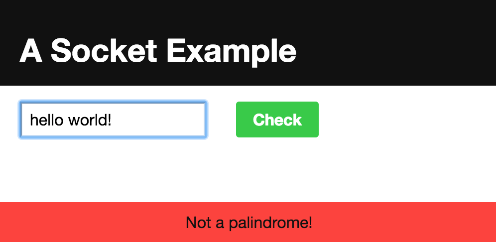

# socket-example  

<div style="text-align:center"></div>
<div style="text-align:center"></div>

## Prerequesites
  node.js
  a browser(IE, Chrome, Firefox)

## Dependencies
  - pug - html renderer
  - express - html server
  - serve-favicon - servers favicon image
  - socket.io - handles web socket

## Node.js Installation (Ubuntu)
  - To install Node.js, type the following command in your terminal:
  ```
  sudo apt-get install nodejs
  ```
  - Then install the Node package manager, npm:
  ```
  sudo apt-get install npm
  111
  - Create a symbolic link for node, as many Node.js tools use this name to execute.
  ```
  sudo ln -s /usr/bin/nodejs /usr/bin/node
  ```
  - Check the current versions of Node.js and npm enter the following commands:
  ```
  node -v
  npm -v
  ```
  


